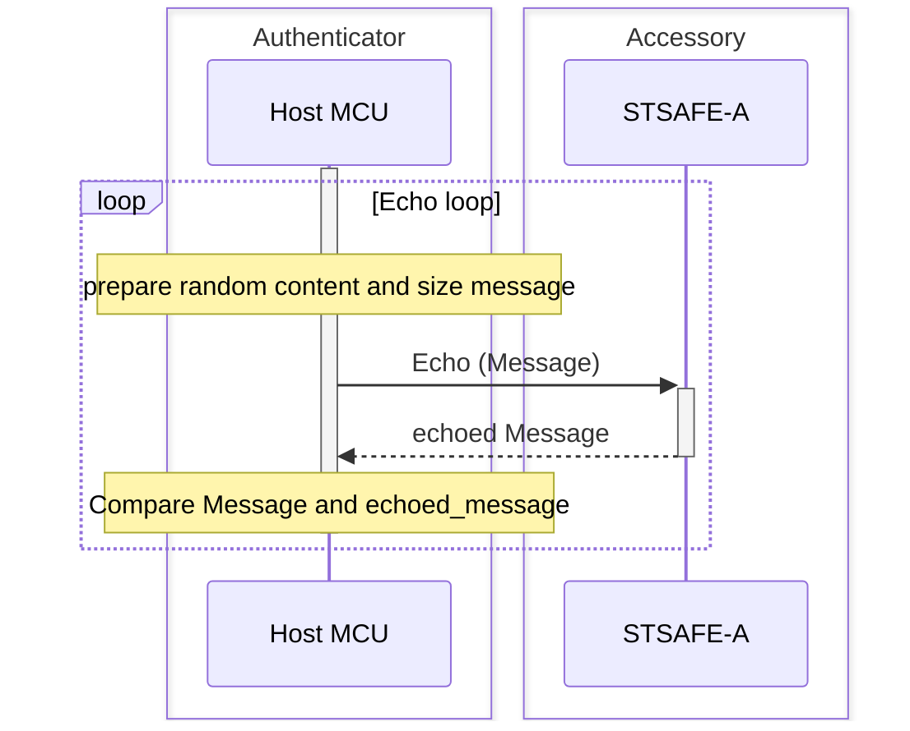
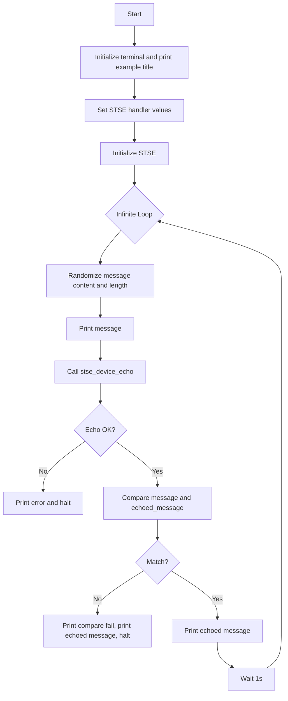

# STSAFE-A Echo Example

This project illustrates how to use the STSAFE-A Secure Element and STMicroelectronics Secure Element Library to perform an echo loop between Host and STSAFE-A Secure Element. 
Echo loop scenario is usefull for :
- SE integration and stability test
- Accessory hot-plug/presence detection

The example applicative flowchart is illustrated below :

STSELib API used in the example are the following :

- stse_init
- stse_echo

## Hardware and Software Prerequisites

- [NUCLEO-L452RE - STM32L452RE evaluation board](https://www.st.com/en/evaluation-tools/nucleo-l452re.html)

- [X-NUCLEO-ESE01A1 - STSAFE-A120 Secure element expansion board](https://www.st.com/en/ecosystems/x-nucleo-ese01a1.html)

- [STM32CubeIDE - Integrated Development Environment for STM32](https://www.st.com/en/development-tools/stm32cubeide.html)

- Serial terminal PC software  (i.e. Teraterm)

## Getting started with the project

- Connect the [X-NUCLEO-ESE01A1](https://www.st.com/en/ecosystems/x-nucleo-ese01a1.html) expansion board on the top of the [NUCLEO-L452RE](https://www.st.com/en/evaluation-tools/nucleo-l452re.html) evaluation board.

- Connect the board to the development computer and Open and configure a terminal software as follow (i.e. Teraterm).

- Open the STM32CubeIDE projects located in Application/STM32CubeIDE

- Build the project by clicking the “**Build the active configurations of selected projects\ **” button and verify that no error is reported by the GCC compiler/Linker.

- Launch a debug session then wait the debugger to stop on the first main routine instruction and press Start button to execute the main routine.

> [!NOTE]
> - Power configuation Jumper must be set to 3V3-VCC.
> - The COM port can differ from board to board. Please refer to windows device manager.

<b>Result</b> :

This project reports execution log through the on-board STLINK CDC bridge.
These logs can be analyzed on development computer using a serial terminal application (i.e.: Teraterm).
As example below.

<pre>
----------------------------------------------------------------------------------------------------------------
-                                    STSAFE-A Echo loop example                                                -
----------------------------------------------------------------------------------------------------------------
 - Initialize target STSAFE-A120
 ## Message :

  0xE5 0xEA 0xB1 0x4A 0xCD 0xF1 0x09 0x61 0xA3 0x41 0xF2 0x30 0xFC 0x86 0xFF 0xCB
  0x24 0xDA 0x9C 0xAE 0xB8 0x69 0xB1 0x57 0x6B 0xB5 0x36 0xA6 0x68 0x9B 0xDD 0xFB
  0xCA 0x41 0xF3 0xC6 0x66 0xE8 0xA0 0x92 0xA4 0x7E 0x11 0x4A 0x26 0x9C 0x42 0x6D
  0x99 0xDE 0x6E 0xD7 0xCB 0x03 0xF8 0x8F 0x4B 0x37 0xD9 0x3B 0xDF 0xFF 0x1E 0x76
  0xEB 0xF8 0x5B 0xB4 0x08 0x8C 0x57 0x1F 0x0D 0x4D 0x32 0xD6 0x66 0x80 0xA1 0xE2
  0x67 0x1C 0x06 0x9A 0xD5 0x83 0x76 0x7E 0xB7 0x09 0x7F 0x1B 0xC4 0x30 0x26 0x6B
  0x12 0x88 0x07 0x31 0x50 0xDF 0xEF 0x04 0x06 0xAA 0xDD 0x1F 0x2D 0xAA 0xCA 0xF9
  0xF6 0xE4 0x3F 0xFF 0x2C 0x13 0xD4 0x55 0xCD 0x12 0xCC 0x79 0x67 0x5D 0xB1 0x78
  0xB3 0x9A 0x06 0xA6 0x07 0x3B 0x1B 0x9C 0x83 0x70 0xD6 0xE8 0x4F 0x21 0x10 0x1F
  0xE8 0xB9 0xEF 0xA9 0x71 0xBE 0x99 0x50 0x37 0xE7 0x54 0x50 0x5D 0xD8 0x45 0xFB
  0x27 0x50 0xD4 0xD3 0x01 0x7F 0xD8 0x06 0x19 0x47 0x5C 0x80 0xFB 0x4B 0x25 0x82
  0x5E 0x88 0x51 0x1B 0xE0 0x39 0x25 0xC8 0x11 0x14 0xFB 0x9F 0x3A 0x6D 0xD9 0xD9
  0x3E 0x9D 0x2E 0x51 0x45 0x47 0xB8 0x04 0x22 0x7A 0xB4 0x01 0xA9 0x2A 0x43 0x73
  0x34 0x33 0x84 0x12 0xE2 0x39 0xBA 0x07 0x96 0x41 0x28 0xD2 0x7E 0x51 0x0E 0xDC
  0xF0 0x2C 0x7C 0xDE 0x1A 0xCB 0x6C 0xDC 0x6E 0x08 0x6C 0xF9 0x4D 0xE8 0x5D 0x10
  0x07 0x66 0x5A 0xFF 0xA6 0x8E 0xE0 0x5F 0x70 0xBA 0xFA 0x86 0xEE 0x73 0x74 0xE1
  0x59 0xEB 0x28 0xB6 0x78 0x74 0x51 0x05 0x99 0x57 0x97 0xF4 0x64 0x86 0x0A 0xD0
  0x63 0xAB 0x6F 0x43 0xDD 0x0F 0x1A 0xF8 0xA4 0x14 0xE0 0x5F 0xB5 0x55 0xD7 0x32
  0x2D 0x2A 0x1E 0x43 0xD1 0x5D 0x80 0x28 0x78 0x0C 0xCB 0x9B 0x4B 0x50 0x1B 0xE8
  0x0F 0x25 0xDA 0xD2 0x00 0x7B 0x5B 0x45 0x6C 0x93 0x25 0xDB 0x63 0xC3 0x58 0xAE
  0x8D 0x97 0xF3 0x30 0xD6 0x5C 0xAB 0x2C 0xF1 0x63 0xCC 0x94 0xEC 0xC4 0x35 0x52
  0x16 0x34 0xCE 0x00 0xAE 0xD8 0x68 0x1A 0x7B 0x65 0xB3 0xAE 0xC8 0xD4 0xF5 0xC9
  0xF2 0x80 0xFD 0x15 0x5F 0xBE 0x4B

 ## Echoed Message :

  0xE5 0xEA 0xB1 0x4A 0xCD 0xF1 0x09 0x61 0xA3 0x41 0xF2 0x30 0xFC 0x86 0xFF 0xCB
  0x24 0xDA 0x9C 0xAE 0xB8 0x69 0xB1 0x57 0x6B 0xB5 0x36 0xA6 0x68 0x9B 0xDD 0xFB
  0xCA 0x41 0xF3 0xC6 0x66 0xE8 0xA0 0x92 0xA4 0x7E 0x11 0x4A 0x26 0x9C 0x42 0x6D
  0x99 0xDE 0x6E 0xD7 0xCB 0x03 0xF8 0x8F 0x4B 0x37 0xD9 0x3B 0xDF 0xFF 0x1E 0x76
  0xEB 0xF8 0x5B 0xB4 0x08 0x8C 0x57 0x1F 0x0D 0x4D 0x32 0xD6 0x66 0x80 0xA1 0xE2
  0x67 0x1C 0x06 0x9A 0xD5 0x83 0x76 0x7E 0xB7 0x09 0x7F 0x1B 0xC4 0x30 0x26 0x6B
  0x12 0x88 0x07 0x31 0x50 0xDF 0xEF 0x04 0x06 0xAA 0xDD 0x1F 0x2D 0xAA 0xCA 0xF9
  0xF6 0xE4 0x3F 0xFF 0x2C 0x13 0xD4 0x55 0xCD 0x12 0xCC 0x79 0x67 0x5D 0xB1 0x78
  0xB3 0x9A 0x06 0xA6 0x07 0x3B 0x1B 0x9C 0x83 0x70 0xD6 0xE8 0x4F 0x21 0x10 0x1F
  0xE8 0xB9 0xEF 0xA9 0x71 0xBE 0x99 0x50 0x37 0xE7 0x54 0x50 0x5D 0xD8 0x45 0xFB
  0x27 0x50 0xD4 0xD3 0x01 0x7F 0xD8 0x06 0x19 0x47 0x5C 0x80 0xFB 0x4B 0x25 0x82
  0x5E 0x88 0x51 0x1B 0xE0 0x39 0x25 0xC8 0x11 0x14 0xFB 0x9F 0x3A 0x6D 0xD9 0xD9
  0x3E 0x9D 0x2E 0x51 0x45 0x47 0xB8 0x04 0x22 0x7A 0xB4 0x01 0xA9 0x2A 0x43 0x73
  0x34 0x33 0x84 0x12 0xE2 0x39 0xBA 0x07 0x96 0x41 0x28 0xD2 0x7E 0x51 0x0E 0xDC
  0xF0 0x2C 0x7C 0xDE 0x1A 0xCB 0x6C 0xDC 0x6E 0x08 0x6C 0xF9 0x4D 0xE8 0x5D 0x10
  0x07 0x66 0x5A 0xFF 0xA6 0x8E 0xE0 0x5F 0x70 0xBA 0xFA 0x86 0xEE 0x73 0x74 0xE1
  0x59 0xEB 0x28 0xB6 0x78 0x74 0x51 0x05 0x99 0x57 0x97 0xF4 0x64 0x86 0x0A 0xD0
  0x63 0xAB 0x6F 0x43 0xDD 0x0F 0x1A 0xF8 0xA4 0x14 0xE0 0x5F 0xB5 0x55 0xD7 0x32
  0x2D 0x2A 0x1E 0x43 0xD1 0x5D 0x80 0x28 0x78 0x0C 0xCB 0x9B 0x4B 0x50 0x1B 0xE8
  0x0F 0x25 0xDA 0xD2 0x00 0x7B 0x5B 0x45 0x6C 0x93 0x25 0xDB 0x63 0xC3 0x58 0xAE
  0x8D 0x97 0xF3 0x30 0xD6 0x5C 0xAB 0x2C 0xF1 0x63 0xCC 0x94 0xEC 0xC4 0x35 0x52
  0x16 0x34 0xCE 0x00 0xAE 0xD8 0x68 0x1A 0x7B 0x65 0xB3 0xAE 0xC8 0xD4 0xF5 0xC9
  0xF2 0x80 0xFD 0x15 0x5F 0xBE 0x4B
----------------------------------------------------------------------------------------------------------------
</pre>
